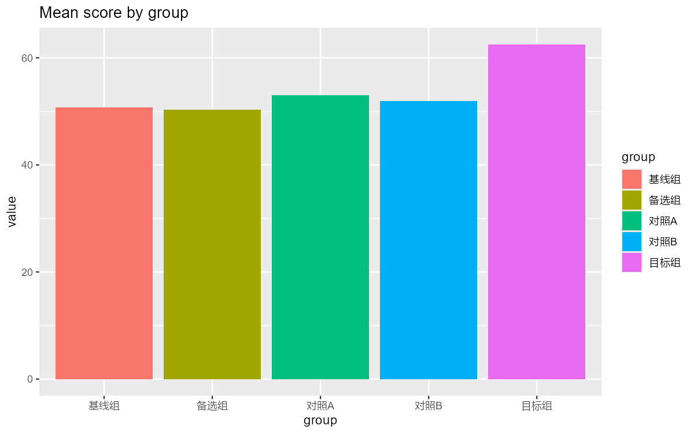
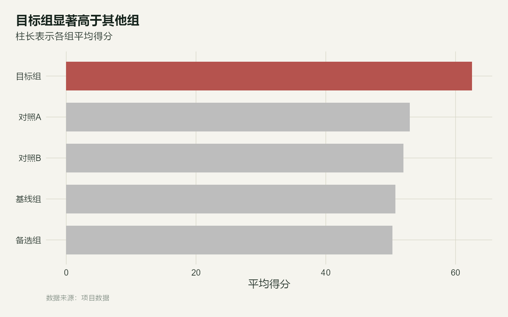

<sub>🌐 <b>中文</b> · <a href="README.en.md">English</a></sub>

<div align="center">

# ggplot2-pub

> *「Agent 画图十次有九次像草稿，第九次还是空白图——这份技能把九次都省了。」*

[](SKILL.md)
[](LICENSE)
[](scripts/smoke-cjk.R)
[](https://skills.sh/zhjx19/ggplot-pub)

**出版级 ggplot2 作图技能：真机验证过每条规则、中文环境不炸的 R 图表规范。**

[看效果](#效果示例) · [安装](#快速开始) · [触发方式](#触发方式) · [它和同类有什么不同](#它和同类有什么不同) · [安全边界](#安全边界)

</div>

---

| 你会让 Agent 画出的图 | 装了本技能后的图 |
| --- | --- |
|  |  |

<sub>同一份数据、同一个 ggplot2，区别只是一份被真机验证过的规范。两图均由 [make-showcase.R](scripts/make-showcase.R) 渲染，可随时复现。</sub>

---

## 它解决什么问题

事情是这样的：让 Agent 用 R 画图，十次有九次你会拿到这样的东西——灰底、五颜六色的默认色板、按字母序排列把重点挤到角落、一个只写着列名的标题，外加一个没人需要的图例。它不是不会画，是没人告诉它"出版级"长什么样。

更糟的是中文用户专属的坑：在终端里跑 R 脚本，中文标签会被旧 locale 搅成乱码，轻则图上全是方块，重则 `ggsave` 直接报一个 `gridtext ... isn't supported` 的天书错误、导出一张**纯空白的图**——而报错信息完全看不出和编码有关。这类事故我们真机复现过（[证据](examples/cjk-crash-mojibake.png)），并把每一条症状和修法写进了技能本体。

本技能不发明新审美，它做三件事：把出版级规则整理成可执行的八步工作流；把中文环境的静默失败变成有症状、有根因、有处置的防线表；给每条关键断言配上冒烟测试，让规则从"口头传统"变成"跑得过的代码"。

## 效果示例

真实输入（三个典型场景，验收标准见 [test-prompts.json](skills/ggplot2-pub/test-prompts.json)）：

```text
① "用 R 画各渠道平均转化率的对比柱状图，放给老板看"
② "画个饼图展示各产品线的收入占比"
③ "审稿人说我的图字太小、标签重叠、颜色像彩虹，帮我改"
```

合格表现：① 先聚合排序再作图，重点高亮其余灰，结论式标题，导出 300dpi PNG 并**打开验证**；② 先给一次"排序柱状图更好"的理由和替代，你坚持饼图它就照做、不反复劝；③ 命中 `base_size` 提升、`ggrepel` 防重叠、Okabe-Ito 色盲安全色板三件套。

## 快速开始

```bash
npx skills add zhjx19/ggplot-pub
```

R 侧依赖：核心 4 包第 0 步自动补装；常用增强就两个；**配色/模板全走零依赖方案，不逼用户装冷门包**：

```r
install.packages(c("ggrepel", "patchwork"))
```

装完对 Agent 说：

```text
用 ggplot2 把这份 CSV 画成出版级对比图：按值排序、重点组高亮、
结论式标题，导出 300dpi PNG 并打开验证中文显示正常。
```

## 触发方式

- "画图 / 作图 / 出图"（R 语言语境）
- "这张 ggplot2 图不好看，帮我改"
- "论文要用的 figure"
- "ggsave 导出的图背景是透明的 / 中文变成方块了"
- "按审稿意见改图"
- "两张图拼成一张（patchwork）"
- "配色改成色盲安全的"

## 它和同类有什么不同

| 维度 | 一般规则文件 / 同类技能 | ggplot2-pub |
| --- | --- | --- |
| 形态 | 规则清单或 Cursor rule，靠文件名触发 | SKILL.md 工作流 + 触发词 description + 深料分层按需加载 |
| 中文环境 | 基本无处理 | 症状→根因→处置防线表 + 冒烟脚本，每条真机复现 |
| 规则可信度 | 口头规范 | 关键断言带实测数字（伪图例 1 vs 0；locale 修复 WARN→PASS 翻转） |
| 依赖策略 | 推荐一堆包，缺了就报错 | 核心 4 包自动装，常用增强仅 ggrepel+patchwork；色板用内置 viridis+Okabe-Ito HEX、显著性括号手写、热图聚类用 base hclust——零依赖覆盖全场景 |
| 安装 | 手动复制文件 | `npx skills add` 一行，装完一句话即可用 |

## 安全边界

- 不修改你的数据文件，只读入作图。
- 不擅自 `install.packages`、不注册系统字体、不改 `.Rprofile`——动这些先问你。
- 不发起任何网络请求（装包除外且需你确认）。
- 你坚持要饼图/3D/双 Y 轴时：提示一次替代方案，之后照做，不啰嗦。
- 只管 R + ggplot2 静态图；Python（matplotlib/plotnine）、plotly 交互图、dashboard 不在范围内。

## 文件结构

```text
ggplot2-pub/
├── SKILL.md                        # 主规范：8 步工作流 + 防线表 + 反模式
├── test-prompts.json               # 3 个功能场景 + 触发/负触发用例
├── references/
│   ├── palettes.md                 # Okabe-Ito / Paul Tol HEX 速查 + 零依赖色盲自检
│   ├── recipes.md                  # 误差条/CI、显著性括号、坐标变换、热图配方
│   ├── multipanel.md               # 多面板决策表、每面板高亮、尺寸估算
│   ├── antipatterns.md             # 反模式前后对照（图 + 代码 + 修法）
│   ├── img/cjk-crash-mojibake.png  # 真实事故截图（乱码标题）
│   └── baseline-v1.2-cursor-rule.md  # v1.2 原始规则存档
├── scripts/
│   ├── smoke-cjk.R                 # 环境冒烟：8 项检查，全 PASS 才交付
│   ├── make-showcase.R             # 重渲染 README 前后对照图
│   └── make-demo.R                 # 可选：重录终端演示 GIF（真实回放，无需 vhs）
├── assets/                         # before/after PNG + vhs 录制带
├── examples/                       # 真实事故证据存档
├── README.md / README.en.md / LICENSE / .claude-plugin/  # 发布包装
└── 本目录即 OpenCode 技能目录，OpenCode 直接加载
```

## 验证与测试

```bash
Rscript scripts/smoke-cjk.R    # 期望：全 PASS（终端下 1 条 WARN 属正常，见防线表）
```

验收 prompt：给 Agent 一份含分类变量的 CSV，说"画成出版级对比图"。合格 = 出现排序、
高亮、`theme_pub`、显式导出参数，且 Agent 主动打开导出文件确认渲染无误。
改任何渲染规则前跑一次冒烟、改完再跑一次——两次都要全 PASS。

## 致谢

- [tidyecology.com](https://tidyecology.com/) —— 默认主题与配色（datasheet 风：纸底、墨字、森林/锈红/金）来源
- [rfigure.skill](https://github.com/qwlei328-maker/rfigure.skill) —— "规则要带实测依据"的手艺来源
- [meodai/skill.color-expert](https://github.com/meodai/skill.color-expert) —— 三层渐进披露与触发用例结构
- [elsevier-figure-style](https://github.com/guhou-hvi/elsevier-figure-style) —— 规则带来源与分档的写法
- [posit-dev/skills](https://github.com/posit-dev/skills) —— 官方 description 触发句式
- [K-Dense-AI/scientific-agent-skills](https://github.com/K-Dense-AI/scientific-agent-skills) —— "Non-negotiable guardrails" 写法
- [mckinsey-style-visualization-skill](https://github.com/kgraph57/mckinsey-style-visualization-skill) / [AgentFigureGallery](https://github.com/Dsadd4/AgentFigureGallery) —— 可见产物与可复现 showcase 的示范
- 色板：Okabe-Ito 与 Paul Tol 公开色板；打磨流程来自 [鲁班 Skill 工坊](https://github.com/LearnPrompt)

## License

[MIT](LICENSE)
