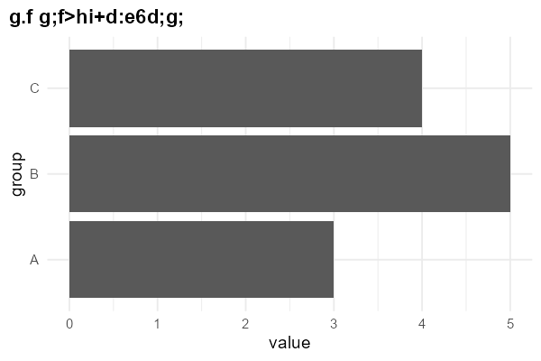

# 反模式前后对照（antipatterns）

> SKILL.md「致命反模式」表的深料：每条配前后代码与真实渲染图。
> 所有图由 `scripts/make-showcase.R` 从同一份真实数据渲染，可随时重跑复现。

## 总对照：默认输出 vs 本技能输出

同一份数据（5 组、每组 40 个观测），左为「未加规范的一次性 ggplot 调用」，右为按本技能规范产出：

| 默认输出（before） | 规范输出（after） |
|---|---|
|  |  |

before 的具体毛病：默认灰底、5 色彩虹映射无意义的 `fill = group`、字母序排列（重点沉底）、
多余图例、小号居中标题说不出结论、轴标题是裸列名。
after 的做法：按值排序、重点用强调色其余中性灰、无图例、左对齐洞察式标题 + 背景副标题 + 来源注脚。

## 逐条修法

### 1. 常量颜色放进 `aes()`（生成伪图例，已实测：伪图例数 1 vs 0）

```r
# 错
geom_point(aes(color = "steelblue"))
# 对
geom_point(color = "steelblue")
```

### 2. 用 `xlim()/ylim()` "放大"（实际是删数据后再统计）

```r
# 错：截断后的统计量是错的
ggplot(d, aes(x, y)) + geom_point() + xlim(0, 5)
# 对：只改视野，不改数据
ggplot(d, aes(x, y)) + geom_point() + coord_cartesian(xlim = c(0, 5))
```

### 3. ggtext textbox 做标题 + 中文（真机事故图见下）

textbox 元素在 legacy locale 下会把乱码拼成伪 HTML 标签，`ggsave()` 直接报
`gridtext has encountered a tag that isn't supported yet: <bf>` 并导出**空白图**：



修法：标题副标题一律 `theme_pub()` 纯文本；富文本只用于单个 geom 标签（`element_markdown()`）。

### 4. 覆盖 textbox 主题元素（ggplot2 ≥4.0 报 merge 错误）

```r
# 错：base_theme 里锁了 element_textbox_simple，这句直接报错
p + theme(plot.title = element_text(size = 20))
# 对：主题用纯 element_text（theme_pub 已如此），可自由覆盖
p + theme(plot.title = element_text(size = 20))   # OK
```

### 5. 柱状图 Y 轴不从 0 开始 / 饼图比多类 / 3D / 双 Y 轴

替代路径见 SKILL.md「致命反模式」表；饼图数据 → 排序柱状图或点图；
双 Y 轴 → 拆两图或标准化后分面。

## 复现方式

```bash
Rscript scripts/make-showcase.R   # 重新渲染 assets/before.png, after.png
Rscript scripts/smoke-cjk.R       # 环境冒烟（应全 PASS）
```

改任何渲染规则前先跑冒烟、改完再跑一遍——两次都要全 PASS。
